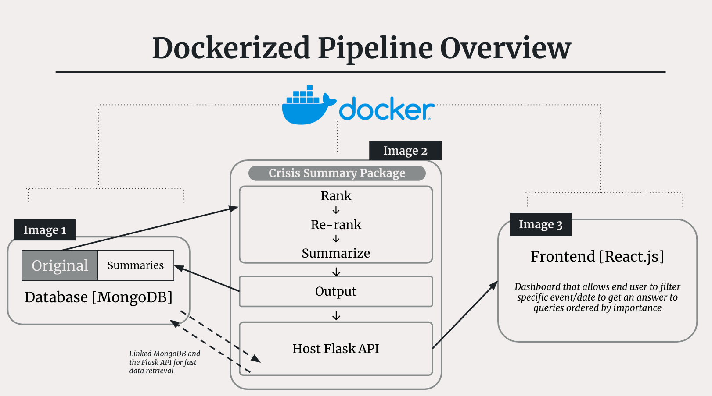
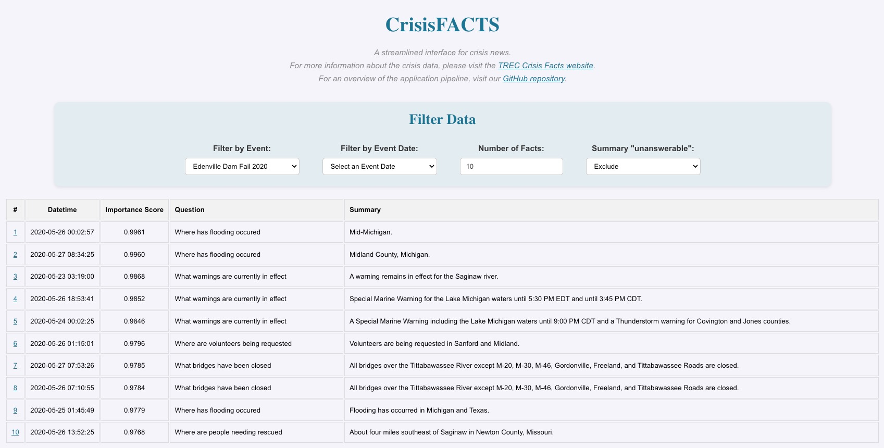
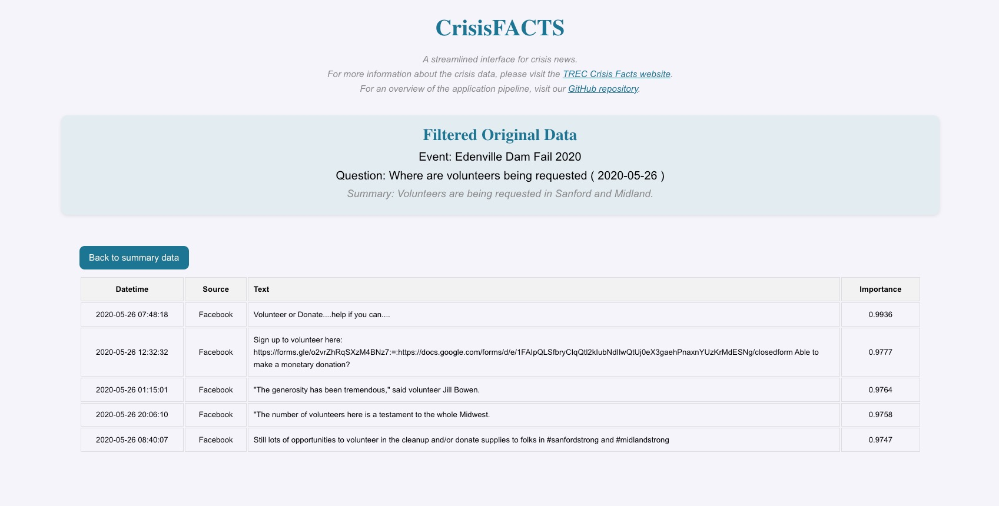

# 🗞️ Information Retrieval: CrisisFACTS 🗞️
*Authors: JaeHo Bahng, Agustina Zuckerberg, Brian Kwon, Jiatong Liu, Shriya Chinthak*

---

Using the data from the [TREC CrisisFACTS](https://crisisfacts.github.io/) challenge, we implemented a project that takes in news regarding crisis events from numerous online sources, ranks them of importance to answer specific questions regading the crisis, summarize imformation into a concise answer, and display the answers in a user-friendly application. 

Below, we will focus our explanation of the frontend portion of the project. However, if you would like a detailed overview of the ranking and summarization portion, please visit our [subdirectory](https://github.com/jaehobahng/crisisfacts_summarization/) for the python package. 

## Project Structure

Below is a brief overview of our file structure. We have also added a key to denote additional information about each file. 

🛠️ - Helper files to application. Please see code for comments and further explanation

```
.
├── README.md
├── images                          --> Used in the README.md
│   ├── frontend_1.jpeg                
│   ├── frontend_2.jpeg 
├── app
│   ├── Dockerfile                  --> Docker configuration for the React app
│   ├── public
│   │   ├── index.html              --> This is the index page which sets up the React app
│   │   ├── manifest.json (🛠️)
│   │   └── robots.txt (🛠️)
│   └── src
│       ├── App.css                 --> css file for App design
│       ├── App.js                  --> javascript implementation of the app's structure
│       ├── App.test.js (🛠️)
│       ├── index.css (🛠️)
│       ├── index.js (🛠️)
│       ├── logo.svg (🛠️)
│       ├── reportWebVitals.js (🛠️)
│       └── setupTests.js (🛠️)
├── crisisfacts_summarization       --> Links to crisisfacts python package repository
└── docker-compose.yml              --> Connects all docker images together
```

## Usage

To run the app, please close the repo with the following bash line to properly clone the crisisfacts package saved within the subrepository. 

```{bash}
git submodule update --init --recursive
```

After cloning, please download the two csv files from [this link](https://drive.google.com/drive/folders/1NBstb4wHWBvZ9LFwGCddPpTFH4zAoqjM?usp=sharing) and place them in the crisisfacts_summarization/output repository.

Then, run the following docker command to build the full application. 

**Note: You must have Docker Desktop open on your machine prior to running the bash command**

```{bash}
docker-compose up --build
```

## Pipeline 

Our pipeline is a three stage dockerized process. 

- Image 1: Our database, consisting of the original CrisisFACTS data and the summarized data from the second step, is created via MongoDB. 

- Image 2: Our crisisfacts python package ranks, reranks, and summarize the news documents into answers for the CrisisFacts queries. We also use a Flask Host API to connect the summarized data from the database to the frontend 

- Image 3: Our frontend application created using React and connect to the Flask API



## Frontend 

Our application provides a streamlined and user-friendly interface to view answers to queries regarding crisis events. 

On the home page, as shown below, we can see that there are 4 main filters. 

- **Event**: a dropdown of crisis events located with the TREC CrisisFACTS dataset

- **Date**: filters the news from that event to a specific datetime. 

- **Facts**: customize the number of facts shown on screen 

- **unanswerable**: shows summaries that were marked as unanswerable based on the ranked importance of news and summarizes from the GPT model. 

To see how to summary was generated, you can also click of the row's **#** index which will bring you to the second page. 



---

On the *second page* of the application, shown below, the light blue box shows event, question, and summary of the row you would have clicked on on the first page. Below are the 5 news pieces that were ranked of highest importance to answer the query and used as inputs for the summarization model. Additionally, you can also see the source from which the news cames from. To go back to the home page, simply click the button on the top left that says *Back to summary data*. 



---


